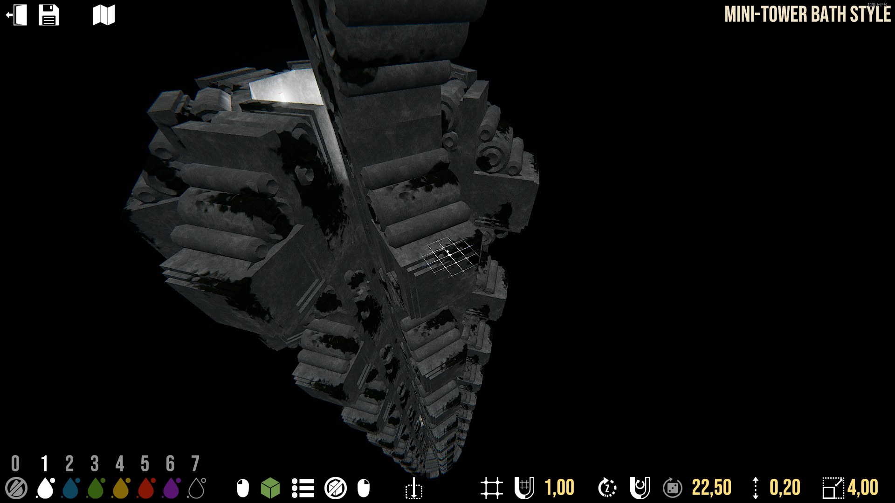

I using 22,5 angle for all walls. 
If you would like less angular walls, you can continue red-line blocks with walls. Otherwise, just delete them. 

If you would like continue walls, you can do this:
